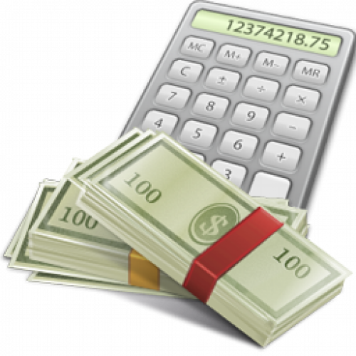
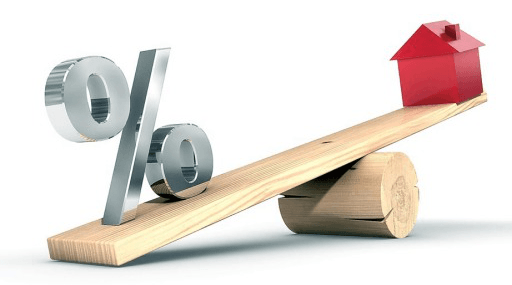

Loan amortization calculator
========================================================
author: Cédric Kameni,B.A.
date: Sat Dec 13 19:33:23 2014

Introducting Loan amortization
========================================================
transition: rotate

In banking and finance, an amortizing loan is a loan where the principal of the loan is paid down over the life of the loan (that is, amortized) according to an amortization schedule, typically through equal payments.

This application will estimate what your yearly payments will be.

***




Application usage
========================================================
transition: rotate

This mortgage loan calculator - also known as an amortization schedule calculator - lets you estimate your yearly loan repayments. It also determines out how much of your repayments will go towards the principal and how much will go towards interest. 

Simply input your:

- Interest rate [%]
- Loan Term[years]
- Loan Amount [$]

then click **submit** in oder to  see the yearly predicted Payment,Interest,Principal and Balance.


Application usage
========================================================
transition: rotate

Example: if you choose to loan an amount of 20,000$  for a period of 5 years and an interest rate of 10%, your amortization plan will look like this:


```
          1year 2year 3year 4year 5year
Payment    6000  5600  5200  4800  4400
Interest   2000  1600  1200   800   400
Repayment  4000  4000  4000  4000  4000
balance   16000 12000  8000  4000     0
```


conlusion
========================================================
left: 60%

The application is great tool to provide a quick design of the loan amortization.


***


Thanks!
